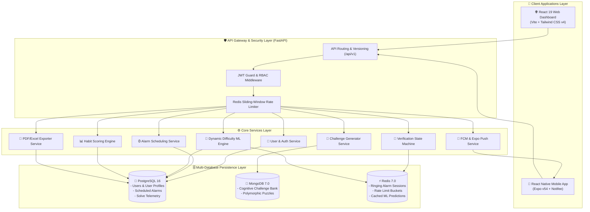
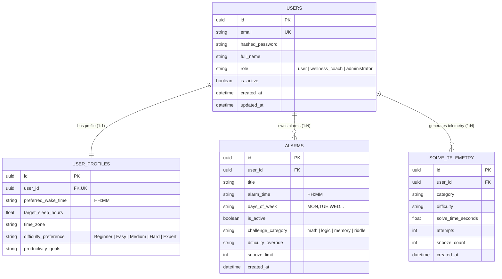
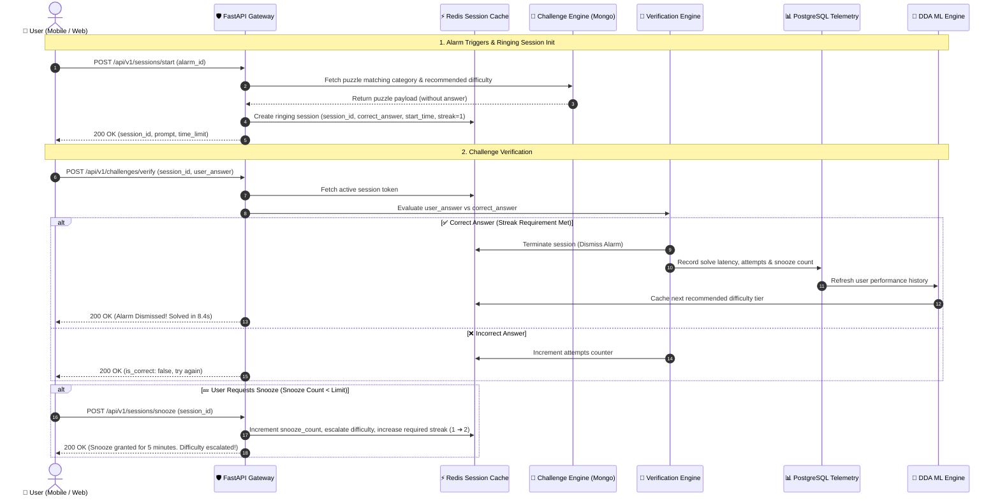
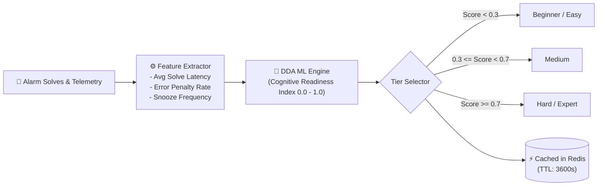
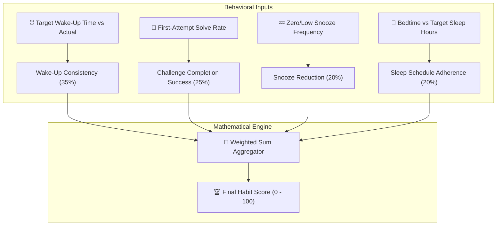
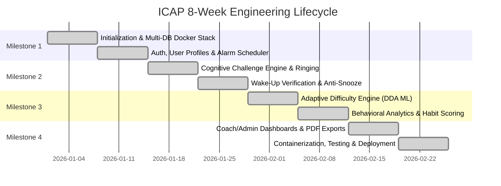

<div align="center">

# 🧠 Intelligent Cognitive Alarm Platform (ICAP)

### _Wake Up Your Mind First — An AI-Powered Habit Formation & Cognitive Awakening Ecosystem_

[](https://fastapi.tiangolo.com)
[](https://www.python.org)
[](https://react.dev)
[](https://expo.dev)
[](https://www.postgresql.org)
[](https://www.mongodb.com)
[](https://redis.io)
[](https://tailwindcss.com)
[](https://www.docker.com)
[](LICENSE)

<p align="center">
  <a href="#-key-features"><b>Key Features</b></a> •
  <a href="#-system-architecture"><b>Architecture</b></a> •
  <a href="#-database-strategy"><b>Database Strategy</b></a> •
  <a href="#-dynamic-difficulty-adaptation-dda"><b>AI & ML Engine</b></a> •
  <a href="#-habit-scoring-formula"><b>Habit Scoring</b></a> •
  <a href="#-api-reference"><b>API Reference</b></a> •
  <a href="#-quick-start"><b>Quick Start</b></a> •
  <a href="CONTRIBUTION.md"><b>Contributing</b></a>
</p>

---

</div>

## 📖 Overview & Value Proposition

Traditional alarm clocks fail because dismissing an alarm requires zero cognitive effort. Users instinctively hit "Snooze" in a semi-conscious state, disrupting sleep architecture, exacerbating sleep inertia, and ruining morning productivity.

The **Intelligent Cognitive Alarm Platform (ICAP)** is an AI-powered, full-stack ecosystem designed to eliminate mindless snoozing and foster long-term behavioral discipline. By requiring users to solve personalized cognitive puzzles before an alarm can be silenced, ICAP stimulates prefrontal cortex activity immediately upon waking.

Equipped with **Dynamic Difficulty Adaptation (DDA)**, a **35/25/20/20 Weighted Habit Scoring Model**, multi-role analytics (User, Wellness Coach, Admin), and automated sleep health reporting, ICAP transforms morning wakefulness into a measurable science.

---

## ✨ Key Features

### 🧠 1. Procedural Cognitive Challenge Engine

- **Diverse Challenge Categories**: Math arithmetic, Procedural Memory Matrices, Logic Riddles, Word Games, Pattern Recognition, and Quick Quizzes.
- **Hybrid Content Generation**: Combines high-speed deterministic algorithmic generators with LLM-backed dynamic generation (Google Gemini / OpenAI fallback).
- **Interactive Practice Playground**: Practice puzzles on demand through the web dashboard or mobile client to train cognitive readiness.

### ⚡ 2. Dynamic Difficulty Adaptation (DDA ML Engine)

- **5 Granular Difficulty Tiers**: `Beginner` ➔ `Easy` ➔ `Medium` ➔ `Hard` ➔ `Expert`.
- **Heuristic & ML Performance Tracking**: Analyzes the last 10 solve telemetry records (reaction latency, solve speed, failure attempts, snooze triggers) to adjust future alarm difficulty automatically.
- **Redis-Cached Inference**: Sub-10ms tier recommendation retrieval at alarm trigger time.

### 🛡️ 3. Wake-Up Verification & Anti-Snooze Safeguards

- **Distributed Ringing Sessions**: Ringing sessions are tracked in Redis with cryptographic session IDs and ephemeral TTLs.
- **Consecutive Streak Solves**: Snoozing an alarm triggers penalty escalation — increasing difficulty and requiring multiple consecutive correct answers.
- **Snooze Lockout**: Strict configurable snooze limits (e.g., maximum 3 snoozes) after which snoozing is locked out until the puzzle is solved.
- **Full-Screen Mobile Lockout**: Lockscreen UI and audio persistence to prevent accidental dismissals.

### 📊 4. Behavioral Telemetry & Weighted Habit Scoring

- **Automated Morning Telemetry**: Collects solve timestamps, response latency, accuracy, and snooze counts.
- **Scientific 100-Point Scoring Model**: Daily computation of wake-up consistency, challenge mastery, snooze reduction, and bedtime schedule adherence.
- **Visual Analytics**: Interactive gauge charts, sleep trend timelines, and streak flame counters.

### 👥 5. Role-Based Access Control & Multi-Portal Architecture

- **👤 User Dashboard**: Manage recurring alarms, view habit scores, analyze personal wake-up trends, and configure difficulty preferences.
- **🩺 Wellness Coach Portal**: Monitor assigned client cohorts, inspect individual habit compliance, track sleep trends, and provide targeted sleep hygiene recommendations.
- **🛡️ Admin Operations Portal**: System-wide telemetry metrics, user role management, error log monitoring, and platform load diagnostics.

### 📑 6. Automated Reports & Export Engine

- **One-Click Data Exports**: Generate professionally formatted PDF and Excel (`.xlsx`) executive reports for sleep duration, snooze reduction, and cognitive performance over custom date ranges.

### 🔔 7. Cross-Platform Push Notification & Sync

- **Bedtime & Wake Reminders**: Firebase Cloud Messaging (FCM) & Expo Notifications deliver timely wind-down prompts and alarm triggers.
- **Multi-Device Real-Time State**: Synchronized alarm state across React Web and React Native Expo mobile clients.

---

## 🏗️ System Architecture

ICAP is architected as a high-performance modular system built with **FastAPI**, **PostgreSQL**, **MongoDB**, and **Redis**.



---

## 🗄️ Database Strategy

ICAP leverages a **polyglot persistence model** tailored to data access patterns:



| Database             | Role & Data Type                                     | Why Selected                                                                                                        |
| :------------------- | :--------------------------------------------------- | :------------------------------------------------------------------------------------------------------------------ |
| **🐘 PostgreSQL 16** | Relational Core (Users, Profiles, Alarms, Telemetry) | ACID compliance, strict schema enforcement, relational integrity via SQLAlchemy ORM & Alembic migrations.           |
| **🍃 MongoDB 7.0**   | Document Question Bank (`cognitive_challenges`)      | Flexible polymorphic schemas for varied puzzle payloads (equations, matrices, riddle hints, tags).                  |
| **⚡ Redis 7.0**     | In-Memory Session Cache & Rate Limiting              | Ephemeral alarm ringing sessions, fast atomic counters for snooze state machines, and sliding-window rate limiting. |

---

## 🔄 End-to-End Alarm Lifecycle & Verification Flow



---

## 🤖 Dynamic Difficulty Adaptation (DDA)

The **Adaptive Difficulty Engine** dynamically calibrates puzzle difficulty to maintain optimal cognitive challenge without causing early-morning frustration.



---

## 📐 Habit Scoring Formula

The platform calculates a comprehensive **Habit Score ($0 - 100$)** every morning using a multi-factor weighted aggregation model:

$$\text{Habit Score} = 0.35(C_{\text{wake}}) + 0.25(S_{\text{challenge}}) + 0.20(R_{\text{snooze}}) + 0.20(A_{\text{sleep}})$$



---

## 🛠️ Technology Stack Matrix

| Domain                    | Technology                                                                                                       | Version          | Purpose                                              |
| :------------------------ | :--------------------------------------------------------------------------------------------------------------- | :--------------- | :--------------------------------------------------- |
| **Backend Framework**     | [FastAPI](https://fastapi.tiangolo.com/)                                                                         | `0.115+`         | Async high-performance REST API Gateway              |
| **Language (Backend)**    | [Python](https://www.python.org/)                                                                                | `3.11+`          | Core server, business logic & ML inference           |
| **Relational Database**   | [PostgreSQL](https://www.postgresql.org/)                                                                        | `16.0`           | Primary ACID relational database                     |
| **ORM & Migrations**      | [SQLAlchemy](https://www.sqlalchemy.org/) / [Alembic](https://alembic.sqlalchemy.org/)                           | `2.0+` / `1.14+` | Object-relational mapping and database migrations    |
| **Document Database**     | [MongoDB](https://www.mongodb.com/) / [Motor](https://motor.readthedocs.io/)                                     | `7.0`            | Polymorphic challenge bank and document store        |
| **In-Memory Cache**       | [Redis](https://redis.io/)                                                                                       | `7.0`            | Ringing sessions, rate limiting, and inference cache |
| **Web Frontend**          | [React](https://react.dev/)                                                                                      | `19.2+`          | Component-based responsive dashboard                 |
| **Build Tool (Web)**      | [Vite](https://vitejs.dev/)                                                                                      | `8.1+`           | Next-generation fast frontend bundler                |
| **Styling**               | [Tailwind CSS](https://tailwindcss.com/)                                                                         | `v4.0`           | Modern dark-mode styling and UI design tokens        |
| **State Management**      | [Zustand](https://github.com/pmndrs/zustand)                                                                     | `5.0+`           | Lightweight state store for web auth and sessions    |
| **Mobile Framework**      | [React Native](https://reactnative.dev/) / [Expo](https://expo.dev/)                                             | `SDK 54`         | Cross-platform iOS and Android mobile app            |
| **Mobile Notifications**  | [Notifee](https://notifee.app/) / [Expo Notifications](https://docs.expo.dev/versions/latest/sdk/notifications/) | `Latest`         | Native alarm audio, background triggers, and push    |
| **AI / Machine Learning** | [Scikit-learn](https://scikit-learn.org/) / [Pandas](https://pandas.pydata.org/)                                 | `Latest`         | DDA heuristics, anomaly detection, behavioral models |
| **LLM Integration**       | [Google Gemini API](https://ai.google.dev/)                                                                      | `v1`             | Dynamic procedural riddle & quiz puzzle generation   |
| **Containerization**      | [Docker](https://www.docker.com/) / [Docker Compose](https://docs.docker.com/compose/)                           | `Latest`         | Multi-container orchestration & cloud deployment     |

---

## 📁 Repository Directory Layout

```text
intelligent-cognitive-alarm-planner/
├── backend/                        # FastAPI Backend Application
│   ├── alembic/                    # PostgreSQL Database Schema Migrations
│   ├── app/
│   │   ├── api/v1/                 # REST API Route Controllers
│   │   │   ├── admin.py            # Platform Telemetry & Admin Endpoints
│   │   │   ├── alarms.py           # Alarm CRUD & Recurrence Management
│   │   │   ├── analytics.py        # Behavioral Analytics & Aggregations
│   │   │   ├── auth.py             # User Auth (Register, Login, JWT)
│   │   │   ├── challenges.py       # Challenge Bank Query Endpoints
│   │   │   ├── coach.py            # Wellness Coach Cohort Dashboards
│   │   │   ├── ml.py               # Dynamic Difficulty Adaptation Endpoints
│   │   │   ├── performance.py      # Reaction Speed & Performance Metrics
│   │   │   ├── profile.py          # Sleep Goals & Profile Customization
│   │   │   ├── reports.py          # PDF & Excel Export Generation
│   │   │   ├── sessions.py         # Ringing Session Lifecycle
│   │   │   ├── snooze.py           # Anti-Snooze Penalty State Machine
│   │   │   ├── telemetry.py        # Solve Telemetry Collectors
│   │   │   └── verify.py           # Puzzle Verification Pipeline
│   │   ├── core/                   # Security, Config & Database Connections
│   │   ├── db/                     # PostgreSQL & MongoDB Session Initializers
│   │   ├── ml/                     # DDA Engine & Sleep Recommendation Models
│   │   ├── models/                 # SQLAlchemy Relational Models (User, Alarm, Telemetry)
│   │   ├── schemas/                # Pydantic v2 Request/Response Data Validation Schemas
│   │   └── services/               # Background Schedulers, FCM & Challenge Generators
│   ├── Dockerfile                  # Production Backend Container Definition
│   ├── docker-compose.yml          # Local Postgres + Mongo + Redis Multi-Container Stack
│   └── requirements.txt            # Python Dependencies
│
├── frontend/                       # React 19 Web Application
│   ├── src/
│   │   ├── components/             # Reusable UI Cards, Navbar, Modal & Charts
│   │   ├── pages/                  # Route Pages (Dashboard, Alarms, Analytics, Coach, Admin, Profile)
│   │   └── store/                  # Zustand Global State Management
│   ├── package.json                # Frontend Dependencies
│   └── tailwind.config.js          # Tailwind CSS Configuration
│
├── mobile/                         # React Native Expo Mobile Application
│   ├── src/
│   │   ├── screens/                # Mobile Screens (Home, Alarms, RingerModal, Habits, Profile)
│   │   ├── navigation/             # Bottom Tab & Stack Navigators
│   │   └── services/               # Audio Playback, Local Alarm API & Push Notification Handlers
│   ├── app.json                    # Expo Manifest Configuration
│   └── eas.json                    # Expo Application Services (EAS) Build Profiles
│
├── docs/                           # Master Handbook & Technical Documentation
│   └── handbook/                   # 8-Week Team Execution Handbook & Architectural Guides
│
├── CONTRIBUTION.md                 # Local Development Setup & Git Contribution Guide
├── README.md                       # Project Master Documentation
└── render.yaml                     # Cloud Deployment Configuration (Render)
```

---

## 📡 REST API Reference Summary

The FastAPI backend exposes fully documented OpenAPI endpoints at `/docs`. Below is a summary of the core routes:

| Method | Endpoint                            | Access        | Description                                                       |
| :----- | :---------------------------------- | :------------ | :---------------------------------------------------------------- |
| `POST` | `/api/v1/auth/register`             | Public        | Register a new user (`user`, `wellness_coach`, `administrator`)   |
| `POST` | `/api/v1/auth/login`                | Public        | Authenticate user credentials and issue JWT access token          |
| `GET`  | `/api/v1/profile/me`                | Authenticated | Retrieve authenticated user profile and sleep settings            |
| `PUT`  | `/api/v1/profile/me`                | Authenticated | Update wake-up goals, target sleep duration, and difficulty       |
| `GET`  | `/api/v1/alarms`                    | Authenticated | List scheduled alarms for current user                            |
| `POST` | `/api/v1/alarms`                    | Authenticated | Create a new recurring or one-time cognitive alarm                |
| `POST` | `/api/v1/sessions/start`            | Authenticated | Initiate an active ringing alarm session and receive challenge    |
| `POST` | `/api/v1/challenges/verify`         | Authenticated | Validate challenge answer, track solve latency, and dismiss alarm |
| `POST` | `/api/v1/sessions/snooze`           | Authenticated | Request snooze, increment penalty tier, and increase streak       |
| `GET`  | `/api/v1/ml/recommended-difficulty` | Authenticated | Query DDA ML model for next optimal puzzle difficulty             |
| `GET`  | `/api/v1/analytics/habit-score`     | Authenticated | Calculate today's 100-point weighted habit score                  |
| `GET`  | `/api/v1/coach/cohorts`             | Coach / Admin | Retrieve aggregated sleep and wake performance for client cohorts |
| `GET`  | `/api/v1/reports/export/pdf`        | Authenticated | Download executive PDF sleep & cognitive performance report       |
| `GET`  | `/api/v1/reports/export/excel`      | Authenticated | Download detailed `.xlsx` behavioral telemetry log report         |
| `GET`  | `/api/v1/admin/platform-metrics`    | Administrator | View platform-wide system load, error rates, and user counts      |

---

## 🗺️ 8-Week Milestone Roadmap



- [x] **Milestone 1: Project Initialization & Core Setup (Weeks 1 & 2)**
  - Multi-database Docker Compose stack (PostgreSQL, MongoDB, Redis).
  - JWT Authentication, bcrypt password hashing, and role-based access control.
  - Relational Alarm models, days-of-week recurrence rules, and CRUD endpoints.
- [x] **Milestone 2: Cognitive Challenges & Verification System (Weeks 3 & 4)**
  - Procedural Math and Memory Matrix dynamic puzzle generators.
  - Redis distributed ringing session tokens with ephemeral TTLs.
  - Anti-snooze penalty escalation and consecutive streak solve requirements.
- [x] **Milestone 3: Adaptive Intelligence & Recommendations (Weeks 5 & 6)**
  - Dynamic Difficulty Adaptation (DDA) ML engine based on 10-solve historical telemetry.
  - 35/25/20/20 Weighted Habit Scoring algorithm with interactive charts.
  - AI Sleep and Wake-Up Optimization recommendation engine.
- [x] **Milestone 4: Analytics, Testing & Deployment (Weeks 7 & 8)**
  - Wellness Coach cohort portal and Admin system telemetry portal.
  - Automated executive PDF and Excel report exporters.
  - Production Docker containerization, automated pytest suite, and cloud deployment.

---

## 🚀 Quick Start

For detailed step-by-step installation guides, environment variable setups, database migrations, and Git workflows, please refer to our **[CONTRIBUTION.md](CONTRIBUTION.md)**.

### Quick Launch Summary:

```bash
# 1. Clone repository
git clone https://github.com/Shadow-sama287/intelligent-cognitive-alarm-platform.git
cd intelligent-cognitive-alarm-platform

# 2. Start PostgreSQL, MongoDB & Redis
cd backend
docker-compose up -d
alembic upgrade head

# 3. Start Backend Server
pip install -r requirements.txt
uvicorn app.main:app --reload --host 0.0.0.0 --port 8000

# 4. Start Web Dashboard (in frontend/)
cd ../frontend
npm install
npm run dev

# 5. Start Mobile App (in mobile/)
cd ../mobile
npm install
npx expo start
```

---

## 📚 Documentation & Reference Links

- 📖 **[Master Handbook](docs/handbook/INDEX.md)**: Comprehensive 8-week task breakdown and system architecture handbook.
- 🤝 **[Contribution & Setup Guide](CONTRIBUTION.md)**: Developer onboarding, Docker instructions, and Git branching rules.
- 📄 **[Project Specification PDF](docs/AI_Intelligent%20Cognitive%20Alarm%20Platform.pdf)**: Official system requirements, evaluation rubric, and mathematical models.
- 🌐 **Interactive API Documentation**: Available locally at `http://localhost:8000/docs`.

---

## 📄 License

This project is licensed under the **MIT License** — see the [LICENSE](LICENSE) file for details.

<div align="center">
  <sub>Built with ❤️ by the Intelligent Cognitive Alarm Platform Engineering Team.</sub>
</div>
